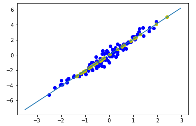

# Tensorflow 2.0 - Linear Regression (V1.0)


This project presents an implementation of a **Linear Regression** model developed with Tensorflow 2.0, so as to get along with the new alpha version of the framework. The model implementation is very simple and is not meant to be perfect or extremely robust, but only to show off we can build a simple Linear Regression model with Tensorflow 2.0 very quickly.

To launch the program and see different visualisations of the model trying to fit data :  
```
python regression.py
```
*NB* : I used `Google colab` to quickly develop and test this model, as well as accessing an already configured and performant environment. Google colab is free for small amounts of data and processing, and is available here :   

The program shall draw scatterplots of points, with the best fit line found by the model through iterative training :  

